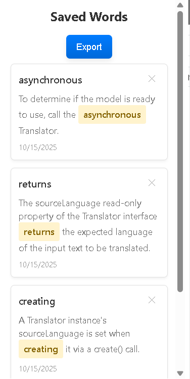

# Word Saver Extension

A Chrome extension that allows you to save selected words and their context for later import into Anki, streamlining the creation of spaced repetition flashcards.

## About the Project

This extension was developed to optimize the process of creating Anki cards from words encountered during reading. Currently (October 2025), the project uses the [Translator API](https://developer.mozilla.org/en-US/docs/Web/API/Translator) for automatic translation, though this API is still experimental and may not work in all browsers.

### Key Features

- Word capture with double Ctrl click
- Full sentence context saving
- Automatic translation (experimental) using the Translator API
- Interface for viewing and managing saved words
- Easy export for Anki import

## Screenshots



- Main extension interface
- Word selection process
- Export example
- Anki integration

## Installation and Setup

### Prerequisites

- Node.js (version 16 or higher)
- npm (usually installed with Node.js)
- Google Chrome

### Development Installation

1. Clone the repository:

```bash
git clone [git@github.com:GustavoFade/word-saver-extension.git]
cd word-saver-extension
```

1. Install dependencies:

```bash
npm install
```

1. Build the extension:

```bash
# For development build with watch mode
npm run build:dev

# For production build
npm run build
```

1. Load the extension in Chrome:
   - Navigate to `chrome://extensions/`
   - Enable "Developer mode" in the top right corner
   - Click "Load unpacked"
   - Select the project's `dist` folder

## How to Use

1. **Saving Words:**
   - Select a word on any webpage
   - Double-press Ctrl quickly
   - The word and its context will be saved automatically

2. **Viewing Saved Words:**
   - Click the extension icon in the toolbar
   - View the list of saved words with their context
   - Use the X button to remove unwanted words

3. **Exporting to Anki:**
   - Click the "Export" button in the extension popup
   - The formatted text will be copied to the clipboard
   - Paste the content into Anki to create flashcards

## Development

### Available Scripts

```bash
# Development with automatic recompilation
npm run build:dev

# Production build
npm run build

# Run linting
npm run lint

# Format code
npm run format
```

### Project Structure

```text
src/
├── background/     # Service worker and background scripts
├── content/        # Page-injected scripts
├── popup/          # Extension UI
└── types/         # TypeScript type definitions
```

## Known Limitations

- The Translator API is experimental and may not work in all browsers
- Currently only supports English -> Portuguese translation
- Requires internet connection to function properly

## Next Steps

- [ ] Support for more languages
- [ ] Improve Anki import formatting
- [ ] Add offline support
- [ ] Implement direct Anki synchronization

## Contributing

Contributions are welcome! Please read our contribution guidelines before submitting pull requests.
